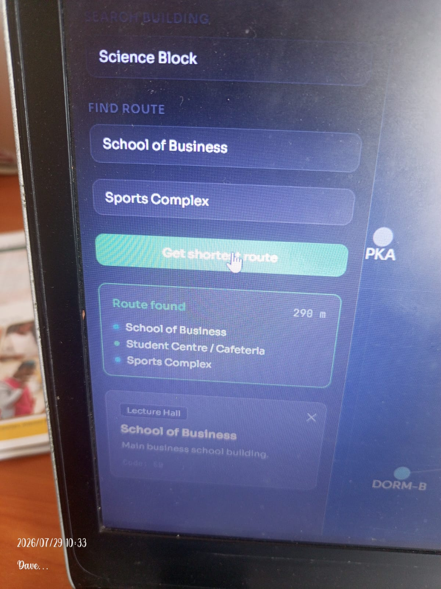
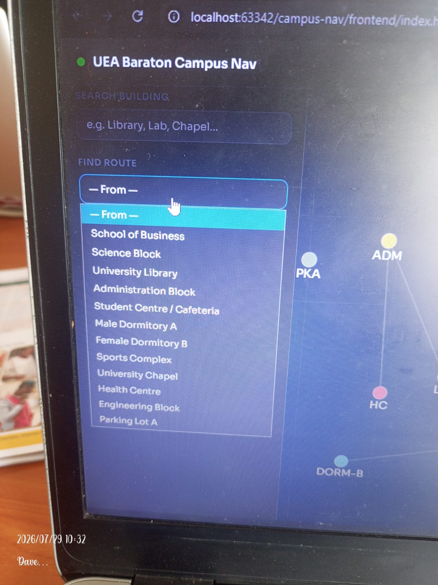
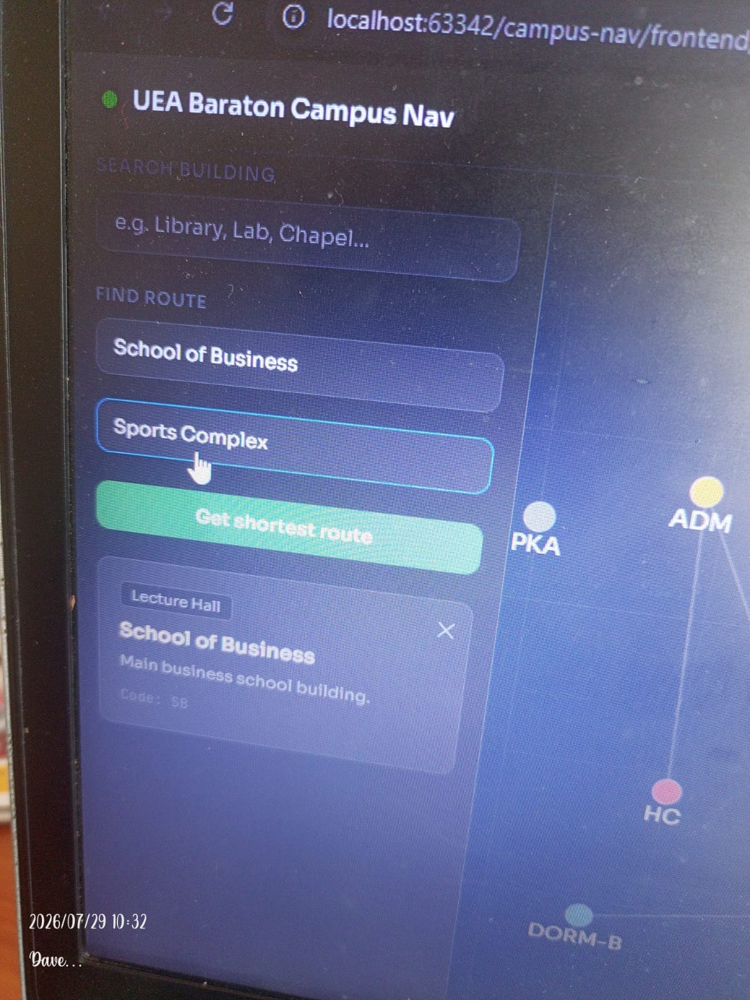
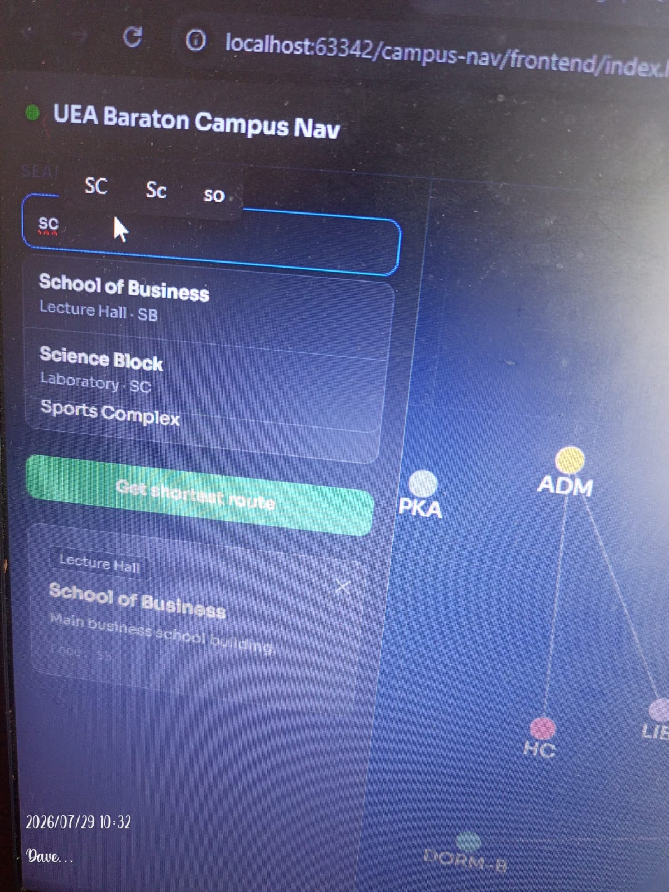
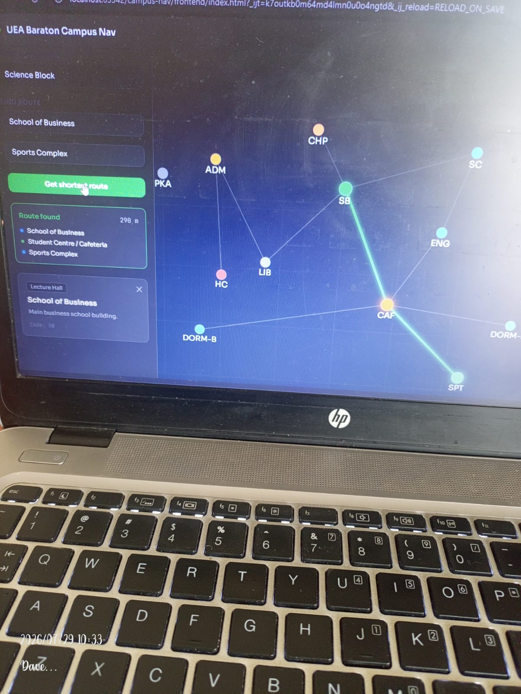
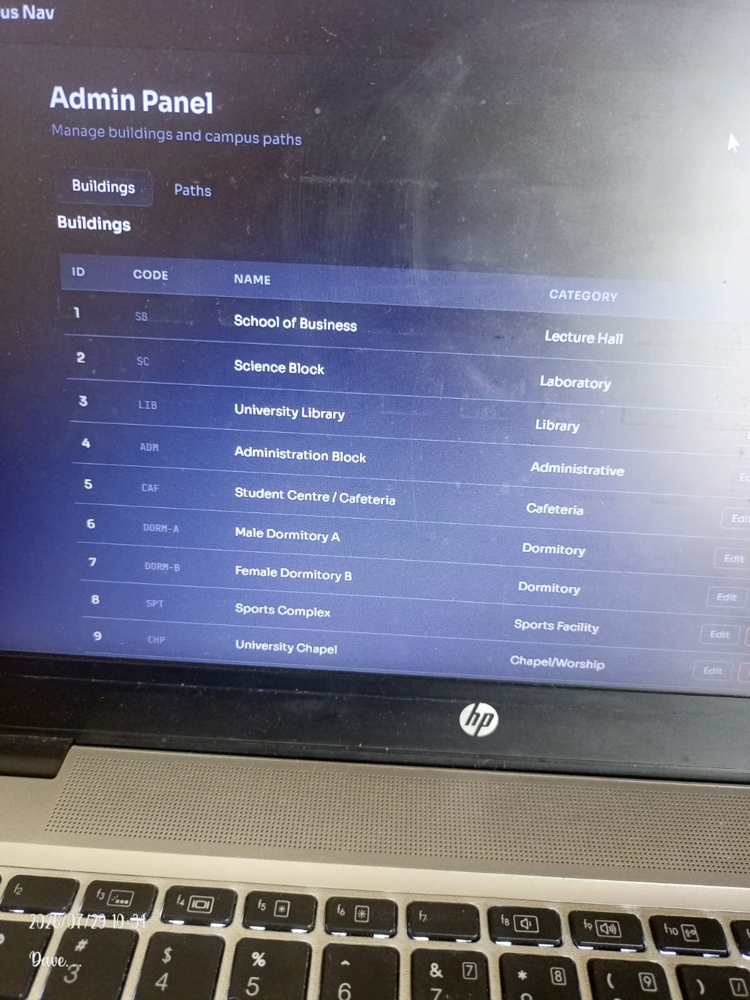
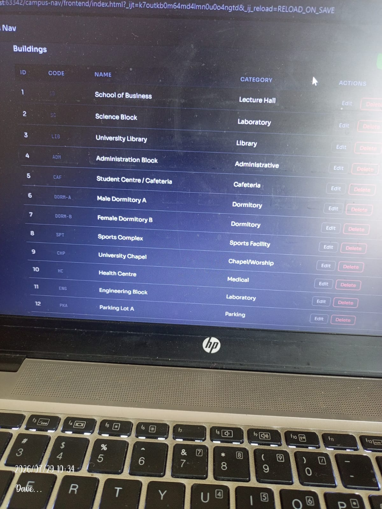
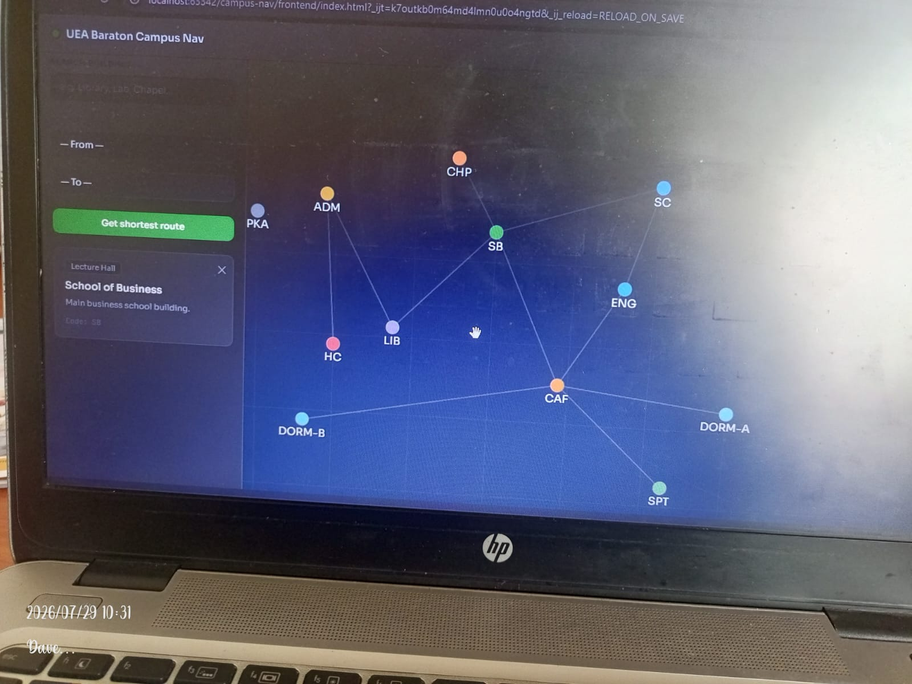
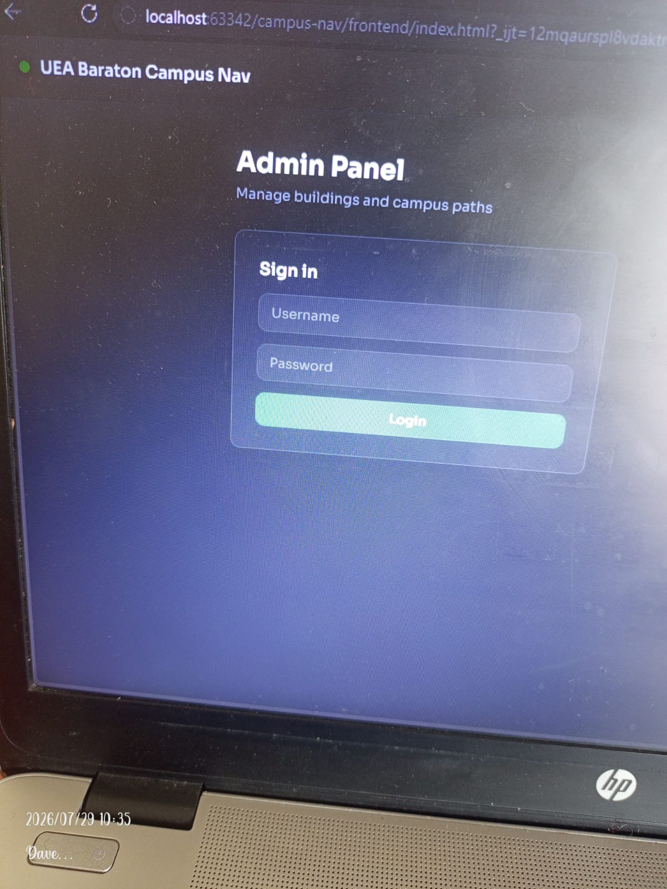

# Campus Navigation System
## System Documentation

---

**Project Title:** Campus Navigation System  
**Course:** INSY492 — Senior Project  
**Institution:** University of Eastern Africa, Baraton  
**School:** School of Business — Department of Information Systems and Computing  
**Author:** David Chikamai (ID: SCHIDA2311)  
**Major:** Bachelor of Business in Information Technology (BBIT)  
**Supervisor:** Mr. Fred Mobisa  
**Instructor:** Mr. Dickson Omari  
**Date:** July 2026  

---

## Table of Contents

1. [Introduction](#1-introduction)
2. [System Overview](#2-system-overview)
3. [Technologies Used](#3-technologies-used)
4. [Database Design](#4-database-design)
5. [Backend API Documentation](#5-backend-api-documentation)
6. [Frontend Documentation](#6-frontend-documentation)
7. [System Screenshots](#7-system-screenshots)
8. [User Guide](#8-user-guide)
9. [Known Limitations and Future Work](#9-known-limitations-and-future-work)

---

## 1. Introduction

### 1.1 Background

The University of Eastern Africa, Baraton campus consists of multiple buildings spread across a wide area. New students, visitors, and even continuing students frequently encounter difficulty locating lecture halls, administrative offices, laboratories, and other facilities. Navigation currently relies on physical signposts and verbal directions, which can cause confusion and delays.

### 1.2 Purpose of This Document

This document serves as the complete technical and user reference for the Campus Navigation System. It describes the system architecture, database design, API endpoints, frontend modules, and provides a visual walkthrough of all major system functions using screenshots taken from the live system.

### 1.3 System Objectives

The system was designed to meet the following specific objectives:

1. Provide an interactive digital campus map displaying all buildings and paths.
2. Implement building search functionality allowing users to find facilities by name, code, or description.
3. Compute and display the shortest walking route between any two campus locations.
4. Provide an administrative module for managing building and path data.

---

## 2. System Overview

### 2.1 Architecture

The system follows a three-tier client-server architecture:

```
┌─────────────────────────────────────────────┐
│              USER / BROWSER                 │
│         (HTML · CSS · JavaScript)           │
└─────────────────────┬───────────────────────┘
                      │ HTTP REST (JSON)
                      ▼
┌─────────────────────────────────────────────┐
│           SPRING BOOT BACKEND               │
│    REST API · Spring Security · Dijkstra    │
│          Running on port 8080               │
└─────────────────────┬───────────────────────┘
                      │ JDBC / JPA
                      ▼
┌─────────────────────────────────────────────┐
│              MYSQL DATABASE                 │
│   campus_nav  (categories, buildings,       │
│               paths, users)                 │
└─────────────────────────────────────────────┘
```

### 2.2 Module Summary

| Module | Description |
|---|---|
| Map Module | Interactive HTML5 Canvas map displaying all buildings as colour-coded nodes connected by path edges. Supports pan, zoom, hover tooltips, and click-to-detail. |
| Search Module | Real-time building search against name, building code, and description fields. |
| Routing Module | Shortest path calculation using Dijkstra's algorithm. Visualises the route on the canvas and lists waypoints with total distance. |
| Admin Module | Authenticated dashboard for adding, editing, and deleting buildings and paths. Protected by role-based access control. |

---

## 3. Technologies Used

### 3.1 Frontend

| Technology | Version / Detail | Purpose |
|---|---|---|
| HTML5 | — | Page structure and semantic markup |
| CSS3 | — | Styling, layout, responsive design |
| JavaScript (ES6+) | — | Application logic, DOM manipulation |
| HTML5 Canvas API | — | Campus map rendering |
| Sora (Google Fonts) | — | Primary UI typeface |
| JetBrains Mono | — | Monospace code/data display |

### 3.2 Backend

| Technology | Version | Purpose |
|---|---|---|
| Java | 17 | Primary backend language |
| Spring Boot | 3.2.0 | Application framework |
| Spring Web | — | REST API layer |
| Spring Data JPA | — | Database persistence and ORM |
| Spring Security | — | Authentication and authorisation |
| Hibernate | — | JPA implementation |
| JJWT | 0.11.5 | JSON Web Token generation and validation |
| Lombok | — | Boilerplate code reduction |
| Maven | — | Build and dependency management |

### 3.3 Database

| Technology | Version | Purpose |
|---|---|---|
| MySQL | 8.x | Relational database |
| MySQL Workbench | — | Database design and administration |

### 3.4 Development Tools

- **IDE:** IntelliJ IDEA (backend), VS Code / Kiro IDE (frontend)
- **Build Tool:** Apache Maven
- **Version Control:** Git
- **Container:** Docker (Dockerfile provided for backend deployment)

---

## 4. Database Design

### 4.1 Entity Relationship Overview

The database contains four tables:

```
categories ──< buildings >── paths
                               │
users (standalone — admin accounts)
```

- A **category** classifies one or many buildings (e.g., Lecture Hall, Laboratory).
- A **building** belongs to one category and holds map coordinates used as graph nodes.
- A **path** is a directed weighted edge between two buildings, used by the routing algorithm.
- A **user** holds admin account credentials with a role of either `ADMIN` or `VIEWER`.

### 4.2 Table: `categories`

Stores the building type classifications.

| Column | Type | Description |
|---|---|---|
| `id` | INT (PK, AUTO) | Primary key |
| `name` | VARCHAR(100) | Category name (e.g., "Lecture Hall") |
| `icon` | VARCHAR(50) | Icon identifier for UI rendering |

**Seeded categories:** Lecture Hall, Laboratory, Administrative, Library, Cafeteria, Dormitory, Sports Facility, Chapel/Worship, Medical, Parking.

### 4.3 Table: `buildings`

Stores each campus location as a node in the navigation graph.

| Column | Type | Description |
|---|---|---|
| `id` | INT (PK, AUTO) | Primary key |
| `name` | VARCHAR(150) | Full building name |
| `code` | VARCHAR(20) UNIQUE | Short display code (e.g., "SB", "LIB") |
| `description` | TEXT | Building description |
| `category_id` | INT (FK) | References `categories.id` |
| `map_x` | DECIMAL(8,2) | X coordinate on campus map canvas |
| `map_y` | DECIMAL(8,2) | Y coordinate on campus map canvas |
| `image_url` | VARCHAR(255) | Optional building image |
| `created_at` | TIMESTAMP | Record creation timestamp |
| `updated_at` | TIMESTAMP | Last update timestamp (auto-updated) |

**Seeded buildings (12):**

| Code | Name | Category |
|---|---|---|
| SB | School of Business | Lecture Hall |
| SC | Science Block | Laboratory |
| LIB | University Library | Library |
| ADM | Administration Block | Administrative |
| CAF | Student Centre / Cafeteria | Cafeteria |
| DORM-A | Male Dormitory A | Dormitory |
| DORM-B | Female Dormitory B | Dormitory |
| SPT | Sports Complex | Sports Facility |
| CHP | University Chapel | Chapel/Worship |
| HC | Health Centre | Medical |
| ENG | Engineering Block | Laboratory |
| PKA | Parking Lot A | Parking |

### 4.4 Table: `paths`

Stores the weighted edges between buildings, forming the campus navigation graph.

| Column | Type | Description |
|---|---|---|
| `id` | INT (PK, AUTO) | Primary key |
| `from_id` | INT (FK) | Source building (references `buildings.id`) |
| `to_id` | INT (FK) | Destination building (references `buildings.id`) |
| `distance` | DECIMAL(8,2) | Distance in metres — used as Dijkstra edge weight |
| `path_name` | VARCHAR(100) | Named walkway (e.g., "Main Boulevard") |
| `is_accessible` | BOOLEAN | Wheelchair accessibility flag |

Paths are stored bidirectionally — each physical walkway has two rows (A→B and B→A). The seeded data contains **30 path records** covering 15 unique bidirectional walkways.

### 4.5 Table: `users`

Stores system administrator accounts.

| Column | Type | Description |
|---|---|---|
| `id` | INT (PK, AUTO) | Primary key |
| `username` | VARCHAR(80) UNIQUE | Login username |
| `email` | VARCHAR(150) UNIQUE | Email address |
| `password_hash` | VARCHAR(255) | BCrypt-hashed password (strength 12) |
| `role` | ENUM('ADMIN','VIEWER') | Access role |
| `active` | BOOLEAN | Account active flag |
| `created_at` | TIMESTAMP | Account creation timestamp |

---

## 5. Backend API Documentation

### 5.1 Base URL

```
http://localhost:8080/api
```

### 5.2 Authentication

The API uses **JWT (JSON Web Token)** based authentication. Public endpoints (read-only building and route queries) do not require a token. Write operations (create, update, delete) require a valid JWT bearer token in the `Authorization` header.

```
Authorization: Bearer <token>
```

Passwords are hashed using **BCrypt** with a cost factor of 12. Sessions are stateless — no server-side session storage is used.

### 5.3 Buildings Endpoints

| Method | Endpoint | Auth | Description |
|---|---|---|---|
| `GET` | `/api/buildings` | None | Retrieve all buildings |
| `GET` | `/api/buildings/{id}` | None | Retrieve a single building by ID |
| `GET` | `/api/buildings/search?q={query}` | None | Search buildings by name, code, or description |
| `GET` | `/api/buildings/category/{categoryId}` | None | Filter buildings by category |
| `POST` | `/api/buildings` | ADMIN | Create a new building |
| `PUT` | `/api/buildings/{id}` | ADMIN | Update an existing building |
| `DELETE` | `/api/buildings/{id}` | ADMIN | Delete a building |

**Example — GET /api/buildings/search?q=library**

```json
[
  {
    "id": 3,
    "name": "University Library",
    "code": "LIB",
    "description": "Main library with reading rooms and digital resources.",
    "category": { "id": 4, "name": "Library", "icon": "book" },
    "mapX": 220.0,
    "mapY": 310.0
  }
]
```

### 5.4 Routing Endpoint

| Method | Endpoint | Auth | Description |
|---|---|---|---|
| `GET` | `/api/route?from={id}&to={id}` | None | Compute shortest path between two buildings |

**Example — GET /api/route?from=1&to=8**

```json
{
  "found": true,
  "totalDistance": 290.0,
  "path": [
    { "id": 1, "name": "School of Business", "code": "SB" },
    { "id": 5, "name": "Student Centre / Cafeteria", "code": "CAF" },
    { "id": 8, "name": "Sports Complex", "code": "SPT" }
  ]
}
```

### 5.5 Auth Endpoint

| Method | Endpoint | Auth | Description |
|---|---|---|---|
| `POST` | `/api/auth/login` | None | Submit credentials to receive JWT token |

**Request body:**

```json
{
  "username": "admin",
  "password": "Admin@1234"
}
```

### 5.6 Paths Endpoints (Admin)

| Method | Endpoint | Auth | Description |
|---|---|---|---|
| `GET` | `/api/paths` | None | Retrieve all path edges |
| `POST` | `/api/paths` | ADMIN | Create a new path edge |
| `DELETE` | `/api/paths/{id}` | ADMIN | Delete a path edge |

### 5.7 Routing Algorithm

The backend implements **Dijkstra's Shortest Path Algorithm** in `RoutingService.java`.

**How it works:**

1. All path edges are loaded from the database and an adjacency map is built in memory.
2. A min-heap priority queue is initialised with the source building at distance 0.
3. The algorithm relaxes edges iteratively — for each visited node, it updates the shortest known distance to each neighbour.
4. Once the target node is dequeued, the algorithm terminates early.
5. The shortest path is reconstructed by tracing the predecessor map back from target to source.

**Complexity:**
- Time: O((V + E) log V) where V = buildings, E = paths
- Space: O(V + E)

---

## 6. Frontend Documentation

### 6.1 File Structure

```
frontend/
├── index.html          # Single-page application shell
├── css/
│   └── style.css       # All styling
└── js/
    ├── api.js          # REST API client (all fetch calls)
    ├── map.js          # Canvas map renderer
    ├── admin.js        # Admin panel logic
    └── app.js          # Application bootstrap and wiring
```

### 6.2 Map Module (`map.js`)

The campus map is rendered on an **HTML5 Canvas** element. Key features:

- **Buildings** are drawn as filled circles colour-coded by category.
- **Paths** are drawn as lines connecting building nodes.
- **Route highlighting** draws a glowing green line over the computed shortest path.
- **Labels** (building codes) appear on nodes when zoom level exceeds 0.7.
- **Hover tooltip** shows the full building name when the cursor is over a node.
- **Click to detail** opens a building information panel in the sidebar.
- **Pan** by clicking and dragging the canvas.
- **Zoom** using the mouse scroll wheel or the +/− toolbar buttons.
- **Reset** returns the map to its default centred view.

**Category colour mapping:**

| Category | Colour |
|---|---|
| Lecture Hall | Green `#2ea043` |
| Laboratory | Blue `#1f6feb` |
| Administrative | Yellow `#d29922` |
| Library | Purple `#8957e5` |
| Cafeteria | Orange `#e36209` |
| Dormitory | Light Blue `#388bfd` |
| Sports Facility | Bright Green `#3fb950` |
| Chapel/Worship | Amber `#f0883e` |
| Medical | Red `#da3633` |
| Parking | Grey `#6e7681` |

### 6.3 Search Module (`app.js`)

- A text input field in the sidebar listens for `input` events.
- On each keystroke, a request is sent to `GET /api/buildings/search?q=`.
- Results (up to 8) are displayed in a dropdown below the input.
- Selecting a result highlights the building and opens its detail panel.
- If the backend is unreachable, search falls back to client-side filtering of the offline sample data.

### 6.4 Routing UI (`app.js`)

- Two `<select>` dropdowns are populated with all buildings on page load.
- The user selects a **From** and **To** building, then clicks **Get Shortest Route**.
- The frontend calls `GET /api/route?from={id}&to={id}`.
- On success, the route is highlighted on the canvas and a step-by-step list with total distance (in metres) is displayed in the sidebar.

### 6.5 Admin Module (`admin.js`)

The admin panel is accessible via the **Admin** navigation button in the top bar.

**Login flow:**
1. User enters username and password.
2. Credentials are posted to `POST /api/auth/login`.
3. The returned JWT token is stored in `localStorage` for subsequent requests.
4. On successful login, the dashboard replaces the login form.

**Buildings tab:**
- Displays all buildings in a table with columns: ID, Code, Name, Category, Actions.
- **Edit** opens a modal form pre-filled with the building's current data.
- **Delete** prompts for confirmation, then calls `DELETE /api/buildings/{id}`.
- **+ Add building** opens an empty modal form for creating a new building.

**Paths tab:**
- Displays all path edges with columns: ID, From, To, Distance, Path Name, Actions.
- **+ Add path** opens a form with dropdowns to select From and To buildings, distance, and path name.
- **Delete** removes a path edge.

### 6.6 Offline / Demo Mode

If the Spring Boot backend is not running, the frontend falls back to embedded sample data (`SAMPLE_BUILDINGS` and `SAMPLE_PATHS` constants in `app.js`). The map renders fully and search works client-side. Route calculation requires the backend.

---

## 7. System Screenshots

> All screenshots were taken on 29 July 2026 from the live system running at `localhost:63342`.

---

### Screenshot 1 — Campus Map with Building Detail Panel



The main map view shows all 12 campus buildings rendered as colour-coded nodes on the HTML5 Canvas. Path connections between buildings are drawn as white lines. The left sidebar shows the building detail panel for the **School of Business (SB)**, which opens when a user clicks on any building node. The panel displays the building's category tag (Lecture Hall), full name, description, and short code.

---

### Screenshot 2 — Route "From" Dropdown — All Buildings Listed



The **Find Route** section of the sidebar shows the "From" dropdown expanded, listing all 12 campus buildings available for route selection. Buildings are listed by full name for clarity. This demonstrates the complete set of navigable locations in the system.

---

### Screenshot 3 — Building Search Results



A user has typed **"SC"** into the Search Building field. The system returns three matching results: School of Business, Science Block (Laboratory · SC), and Sports Complex. The search matches against building names, codes, and descriptions simultaneously. The building detail panel for School of Business remains visible in the background.

---

### Screenshot 4 — Route Selection (From and To Selected)



Both route dropdowns are filled: **School of Business** as the origin and **Sports Complex** as the destination. The user is about to click the green **Get Shortest Route** button to trigger Dijkstra's algorithm on the backend.

---

### Screenshot 5 — Route Result Panel



After clicking **Get Shortest Route**, the sidebar displays the computed route result. The system found the shortest path at **290 metres**, passing through three waypoints:

1. School of Business (SB)
2. Student Centre / Cafeteria (CAF)
3. Sports Complex (SPT)

The algorithm correctly identified the indirect route via the Cafeteria as shorter than any direct connection.

---

### Screenshot 6 — Route Highlighted on Map



The same SB → CAF → SPT route is visualised on the canvas with a bright green glowing line connecting the three nodes. Route nodes are enlarged and glow to distinguish them from non-route buildings. This provides immediate spatial context for the computed path.

---

### Screenshot 7 — Admin Buildings Table (Full List)



The Admin dashboard Buildings tab displays all 12 campus buildings in a data table. Each row shows the building's ID, short code, full name, and category. The **Edit** and **Delete** action buttons on each row allow administrators to manage building records. This view is only accessible after successful admin authentication.

---

### Screenshot 8 — Admin Login Screen



The Admin Panel login screen presents a **Sign in** form with Username and Password fields. Access to the administrative dashboard requires valid credentials. Passwords are stored as BCrypt hashes in the database. An incorrect login attempt displays an error message below the form.

---

### Screenshot 9 — Admin Dashboard After Login



After successful authentication, the admin dashboard becomes visible. The panel header reads "Admin Panel — Manage buildings and campus paths." Two tabs are available: **Buildings** (active, showing the buildings table) and **Paths** (for managing campus path edges). The full list of all 12 buildings is loaded from the backend API upon login.

---

## 8. User Guide

### 8.1 For Students and Visitors

**Viewing the campus map:**

1. Open the system in a web browser. The map loads automatically on the **Map** tab.
2. All campus buildings appear as coloured circles. Each colour represents a building category (see the colour legend in Section 6.2).
3. Use the **+** and **−** buttons at the top-right of the map to zoom in and out.
4. Click and drag on the map to pan around the campus.
5. Hover over any building node to see its name in a tooltip.
6. Click on any building node to open the detail panel on the left, showing the building name, category, code, and description.

**Searching for a building:**

1. Click the **Search Building** field on the left sidebar.
2. Type any part of the building name, code, or description (e.g., "lib", "LIB", "library").
3. A dropdown will show matching results.
4. Click a result to select that building and view its details.

**Finding the shortest route between two buildings:**

1. Under **Find Route**, click the **From** dropdown and select your starting location.
2. Click the **To** dropdown and select your destination.
3. Click the green **Get Shortest Route** button.
4. The shortest walking route will be highlighted on the map in green.
5. The sidebar will show the list of waypoints and the total walking distance in metres.

### 8.2 For Administrators

**Logging in:**

1. Click the **Admin** button in the top navigation bar.
2. Enter your username and password on the Sign in form.
3. Click **Login**. On success, the admin dashboard opens.

**Adding a new building:**

1. In the Admin dashboard, click the **Buildings** tab.
2. Click the **+ Add building** button.
3. Fill in the Name, Code, Description, and map coordinates (Map X and Map Y) in the modal form.
4. Click **Save**. The building is created in the database and will appear in the table and on the map.

**Editing a building:**

1. Locate the building in the Buildings table.
2. Click the **Edit** button on that row.
3. Update the fields in the form and click **Save**.

**Deleting a building:**

1. Click the **Delete** button on the building's row.
2. Confirm the deletion in the confirmation dialog.
3. Note: deleting a building also removes all path edges connected to it.

**Managing paths:**

1. Click the **Paths** tab in the admin dashboard.
2. Click **+ Add path** to create a new connection between two buildings.
3. Select the **From** and **To** buildings from the dropdowns, enter the distance in metres and an optional path name.
4. Click **Save**. The new edge will be used in future route calculations immediately.
5. To remove a path, click the **Delete** button on that path's row.

---

## 9. Known Limitations and Future Work

### 9.1 Current Limitations

| Limitation | Detail |
|---|---|
| JWT filter incomplete | The `JwtAuthenticationFilter` class is referenced in `SecurityConfig` but not yet implemented as a full source file. Admin authentication against a live backend requires completion of this component. A local development fallback exists in the frontend. |
| No real-time GPS tracking | As stated in the project scope, the system does not use GPS or live location tracking. |
| No mobile native app | The system is a web application only. A native Android or iOS app was not in scope for this phase. |
| Map coordinates are relative | Building positions are defined as pixel coordinates on a fixed canvas, not real-world GPS coordinates. |
| No path accessibility filtering | The `is_accessible` flag exists in the database but is not yet used to filter routes for wheelchair users. |

### 9.2 Recommendations for Future Development

1. **Complete JWT authentication** — implement `JwtAuthenticationFilter` and `JwtService` to fully secure the admin API.
2. **GPS integration** — replace canvas pixel coordinates with real latitude/longitude and render on a map library such as Leaflet.js or Google Maps.
3. **Mobile application** — develop a Flutter or React Native client using the existing REST API.
4. **Accessibility routing** — add a "wheelchair accessible" toggle that constrains Dijkstra's algorithm to only use `is_accessible = TRUE` path edges.
5. **Turn-by-turn directions** — generate human-readable walking instructions (e.g., "Turn left after the Library, walk 90m to the Cafeteria").
6. **Building images** — populate the `image_url` field with actual photos of each campus building.
7. **User accounts** — allow students to save favourite locations or recent routes.

---

*End of Document*

---

**University of Eastern Africa, Baraton**  
Department of Information Systems and Computing  
INSY492 — Senior Project | 2026
